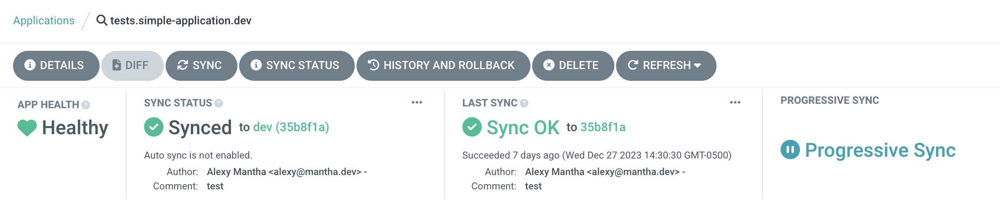

# argocd-progressive-sync-extensions

ArgoCD UI extension to provide better feedback on the status of progressive syncs. It adds a new box in the status panel when the current application is waiting for a progressive sync to progress.



## Prerequisites

This extension depends on the Progressive Sync alpha feature and needs to be enabled manually, see [docs](https://argo-cd.readthedocs.io/en/stable/operator-manual/applicationset/Progressive-Syncs/) for more information on how to enable and use the feature.

## Installation
The extension can be installed using the [ArgoCD Extension Installer init container](https://github.com/argoproj-labs/argocd-extension-installer). 

Here is an example of a Kustomize patch to install the extension: 
```yaml
apiVersion: apps/v1
kind: Deployment
metadata:
  name: argocd-server
spec:
  template:
    spec:
      initContainers:
      - name: progressive-sync
        image: quay.io/argoprojlabs/argocd-extension-installer:v0.0.1
        env:
        - name: EXTENSION_URL
          value: https://github.com/alexymantha/argocd-progressive-sync-extension/releases/download/<VERSION>/extension.tar.gz
        - name: EXTENSION_CHECKSUM_URL
          value: https://github.com/alexymantha/argocd-progressive-sync-extension/releases/download/<VERSION>/checksum.txt
        securityContext:
          allowPrivilegeEscalation: false
          runAsUser: 1000
        volumeMounts:
          - mountPath: /tmp/extensions/
            name: extensions
      # Also need to update the default container to add the volume mount and define the volume
      containers:
        - name: argocd-server
          volumeMounts:
            - name: extensions
              mountPath: /tmp/extensions/
      volumes:
        - name: extensions
          emptyDir: {}
```
**Replace `<VERSION>` with the desired extension version**
